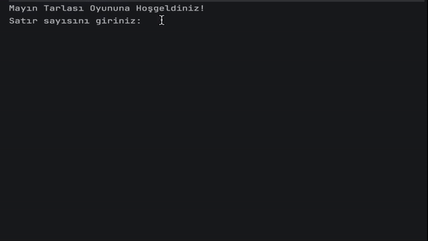
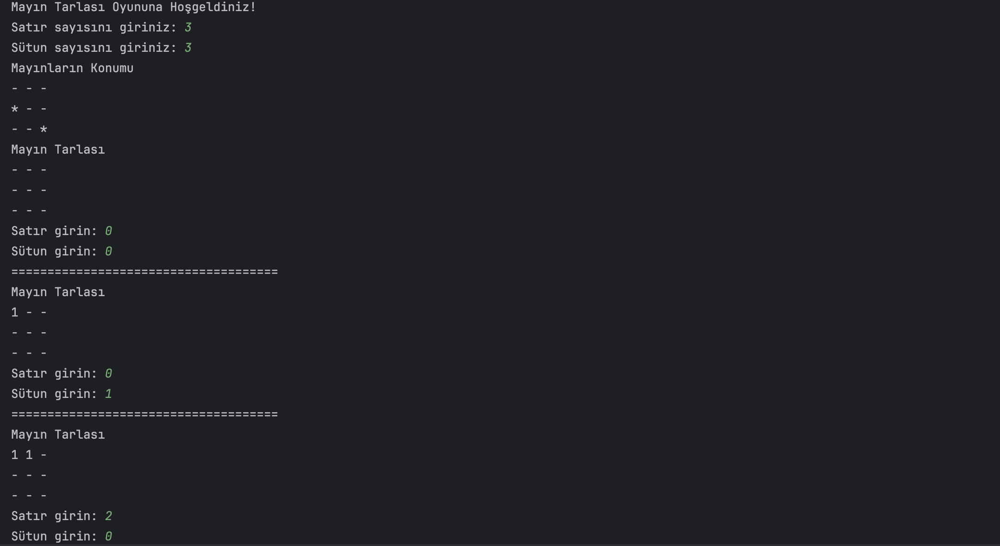
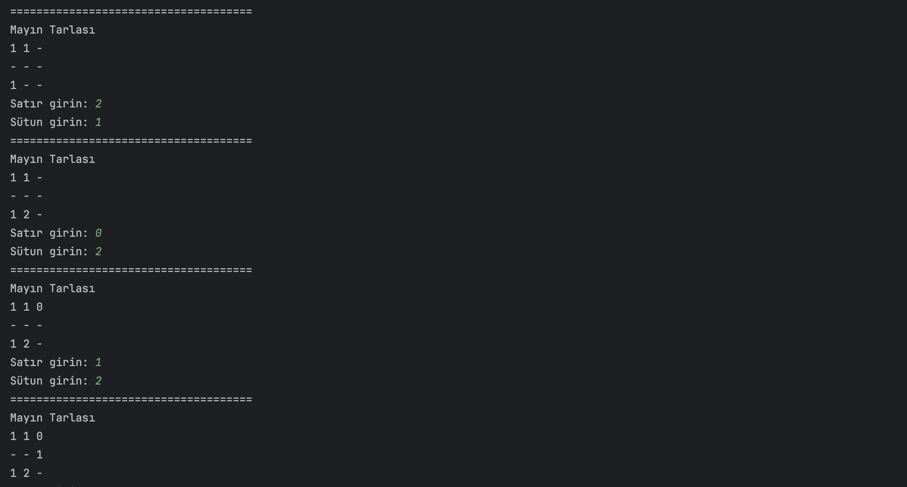
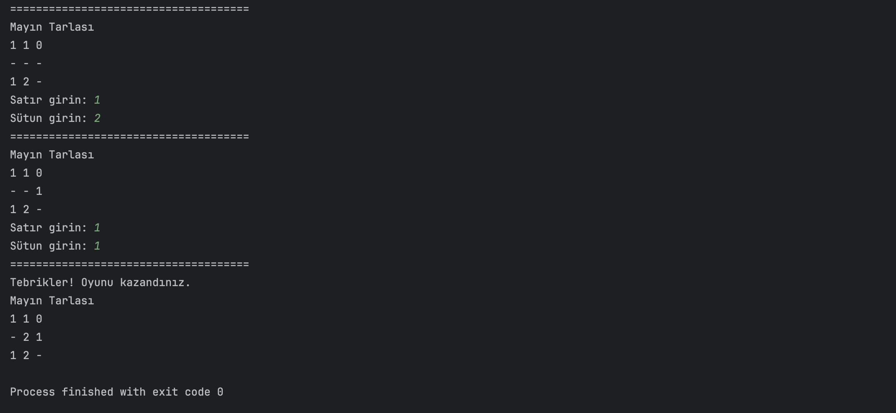
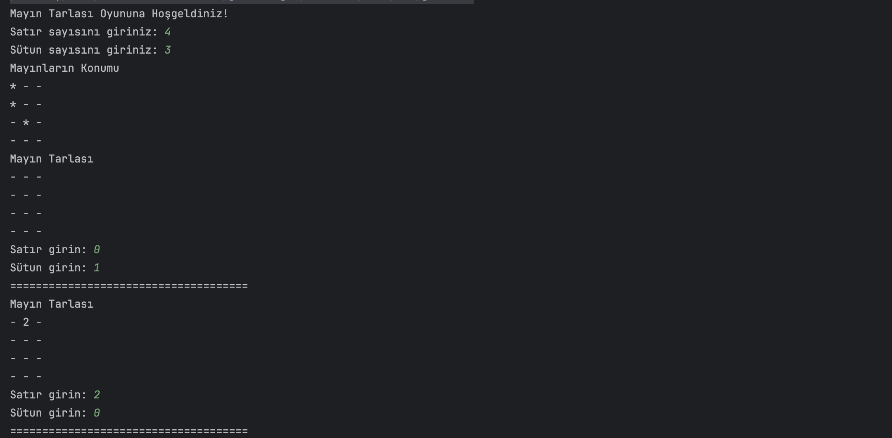
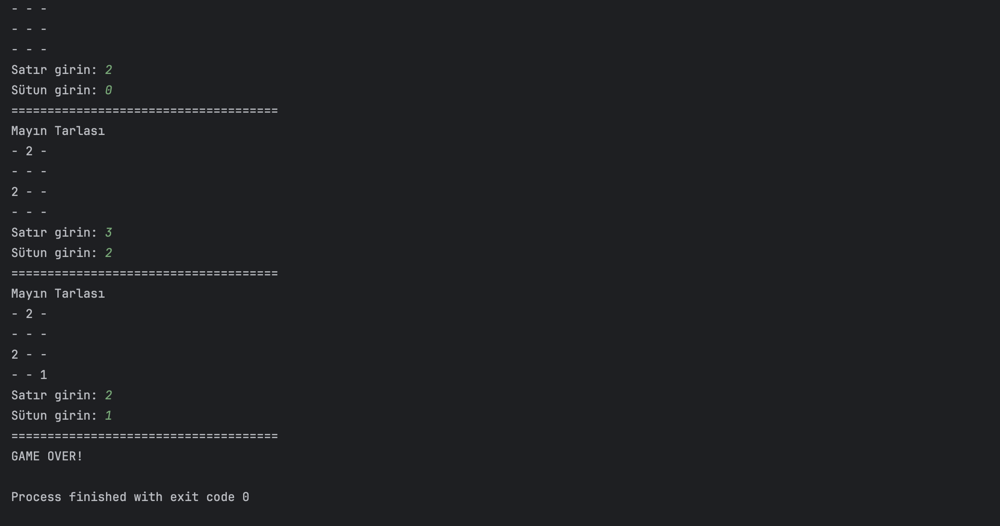

<h1 align="center"> MineSweeper Oyunu </h1>
<h3 align="center"> Java ile Geliştirilmiş Metin Tabanlı Mayın Tarlası Oyunu </h3>  

<br/>

<p align="center"> 
  
</p>

<!-- TABLE OF CONTENTS -->
<h2 id="table-of-contents"> :book: İçerik</h2>

<details open="open">
  <summary>İçerik</summary>
  <ol>
    <li><a href="#proje-ozeti"> ➤ Proje Özeti</a></li>
    <li><a href="#kurallar"> ➤ Oyun Kuralları</a></li>
    <li><a href="#algoritmalar-ve-kod-aciklamasi"> ➤ Algoritmalar ve Kod Açıklaması</a></li>
    <li><a href="#teknolojiler"> ➤ Kullanılan Teknolojiler</a></li>
    <li><a href="#kurulum"> ➤ Kurulum ve Başlatma</a></li>
    <li><a href="#oyun-gorselleri"> ➤ Oyun İçi Görseller</a></li>
    <li><a href="#iletisim"> ➤ İletişim ve Bilgiler</a></li>
  </ol>
</details>


<!-- PROJECT OVERVIEW -->
<h2 id="proje-ozeti"> :mag_right: Proje Özeti</h2>

<p align="justify"> 
</p>


<!-- RULES -->
<h2 id="kurallar"> :scroll: Oyun Kuralları</h2>

<p align="justify"> 
MineSweeper oyunu, aşağıdaki kurallara göre oynanır:

- Oyun tamamen metin tabanlıdır ve Java'nın iki boyutlu dizileri kullanılarak tasarlanmıştır.
- Oyun, MineSweeper sınıfı içerisinde tasarlanmıştır ve metodlar kullanılarak kod tekrarı önlenmiştir.
- Oyuncular, oyun başlangıcında matrisin boyutunu (satır ve sütun sayısını) kendileri belirler. Matrisin minimum boyutu 2x2'dir. Eğer oyuncu 2x2'den küçük bir değer girerse, uyarı verilir ve tekrar giriş yapması istenir.
- Diziye ait eleman sayısının çeyreği kadar mayın rastgele yerleştirilir. Örneğin, 4x3 boyutunda bir dizi için 12 / 4 = 3 adet mayın yerleştirilir.
- Oyunculara gösterilen haritada açılmamış kutucuklar "-" sembolü ile gösterilir.
- Mayınlar "*" sembolü ile gösterilir ve farklı semboller kullanılmaz.
- Oyuncular, matris üzerinden bir nokta seçer ve bu seçim için satır ve sütun değerleri girer.
- Seçilen noktanın dizinin sınırları içerisinde olup olmadığı kontrol edilir. Eğer sınırlar dışındaysa, uygun uyarı metni yazdırılır ve oyuncudan yeni bir koordinat istenir.
- Daha önce girilmiş bir koordinat tekrar girildiğinde, "bu koordinat daha önce girildi, başka bir koordinat girin" şeklinde uyarı gösterilir.
- Eğer oyuncunun girdiği noktada mayın varsa, oyuncu oyunu kaybeder ve buna uygun mesaj gösterilir.
- Oyuncunun girdiği noktada mayın yoksa, noktanın etrafındaki tüm komşu konumlara bakılır ve bu komşu noktalardaki mayınların sayısının toplamı oyuncunun girmiş olduğu koordinata yazılır. Eğer noktaya değen herhangi bir mayın yoksa "0" değeri yazılır.
- Oyuncu, hiçbir mayına basmadan tüm noktaları açarsa oyunu kazanır ve buna uygun mesaj gösterilir.

</p>


<!-- ALGORITHMS AND CODE EXPLANATION -->
<h2 id="algoritmalar-ve-kod-aciklamasi"> :gear: Algoritmalar ve Kod Açıklaması</h2>

<p align="justify"> 
MineSweeper oyunu, Java programlama dili kullanılarak geliştirilmiş ve bir dizi algoritma ve metod içermektedir. Aşağıda, oyunun temel bileşenlerini oluşturan bazı önemli metodların işleyişi ve algoritmaları açıklanmıştır:
</p>

### `playGame` Metodu
Bu metod, oyunun ana döngüsünü içerir. İlk olarak `createMineField` metodunu çağırarak mayın tarlasını oluşturur ve ardından `printMineField` ile mayınların yerlerini gösterir. Oyun, kullanıcı bir mayına basana veya tüm ("-") alanlarını açana kadar devam eder. Her döngüde, kullanıcının girdiği koordinatlar `userInput` metodu ile alınır ve `checkMine` metodu ile kontrol edilir. Eğer oyun bitmişse, kazanma mesajı gösterilir.

### `createMineField` Metodu
Bu metod, mayın tarlasını oluşturur. İki boyutlu diziler kullanılarak, her alan başlangıçta ("-") olarak işaretlenir. Daha sonra, toplam alan sayısının dörtte biri kadar mayın ("*"), rastgele alana yerleştirilir.

### `printMineField` Metodu
Bu metod, mayın tarlasının gerçek durumunu (mayınların yerlerini) konsola yazdırır. Bu, oyunun başında kullanıcıya mayınların yerlerini göstermek için kullanılır.

### `checkMine` Metodu
Kullanıcının seçtiği alanın koordinatlarını alır ve bu alanın daha önce seçilip seçilmediğini kontrol eder. Bu alanda mayın varsa oyun sona erer, mayın yoksa `countMines` metodu çağrılır ve etrafındaki mayın sayısı hesaplanır.

### `countMines` Metodu
Bu metod, belirli bir alanın etrafındaki mayın sayısını hesaplar. Alanın komşuları taranır ve her bir mayın için sayacı arttırır. Bu sayı, kullanıcıya o alanın etrafındaki mayın riskini gösterir.

### `isGameFinished` Metodu
Oyunun bitip bitmediğini kontrol eder. Eğer tüm ("-") alanlar açılmışsa ve mayınlara basılmamışsa, oyun kazanılmış demektir.

</p>


<!-- TECHNOLOGIES -->
<h2 id="teknolojiler"> :computer: Kullanılan Teknolojiler</h2>

<p align="justify"> 
Projede kullanılan teknolojiler:

[](https://www.python.org/) <br>
[](https://www.python.org/) <br>

</p>


<!-- INSTALLATION -->
<h2 id="kurulum"> :hammer: Kurulum ve Başlatma</h2>

<p align="justify"> 
Projeyi  klonlamak ve çalıştırmak için aşağıdaki adımları takip edin:

```bash
git clone https://github.com/esrasen/Minesweeper-Game.git
cd MineSweeper-Game
```

Projeyi IDE'nizde açın ve `Main` sınıfını çalıştırın.
</p>


<!-- GAME SCREENSHOTS -->
<h2 id="oyun-gorselleri"> :camera: Oyun İçi Görseller</h2>

<p align="justify"> 

### Oyun Kazanma Senaryosu

1)

2)

3)


### Oyun Kaybetme Senaryosu

1)

2)


</p>


<!-- CONTACT -->
<h2 id="iletisim"> :phone: İletişim ve Bilgiler</h2>

<p>
✤ <a href="https://linkedin.com/in/esra-sen">LinkedIn</a> <br>
✤ <a href="https://github.com/esrasen">GitHub</a> <br>
</p>
